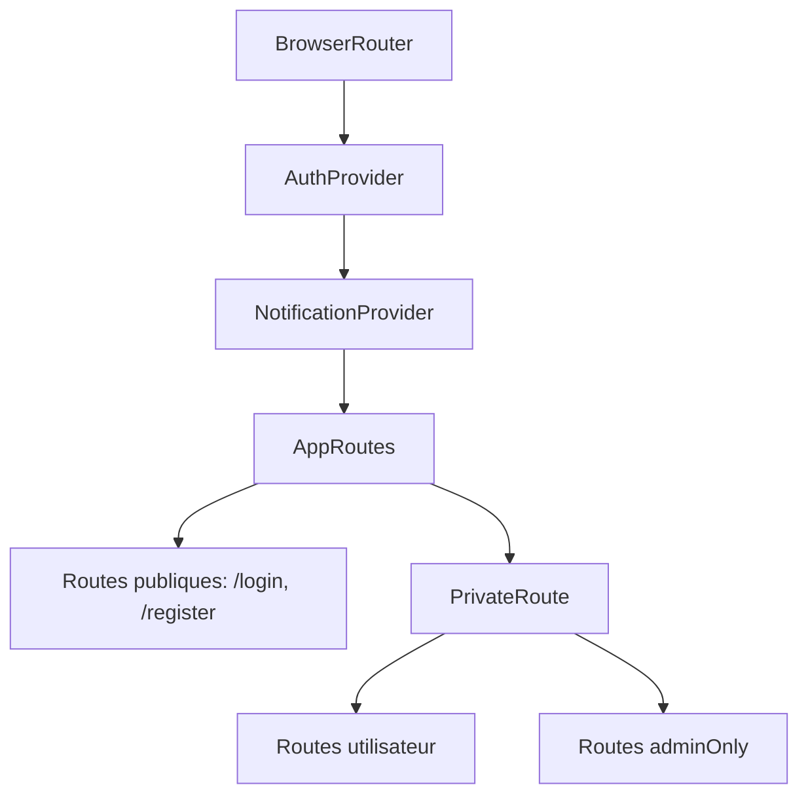
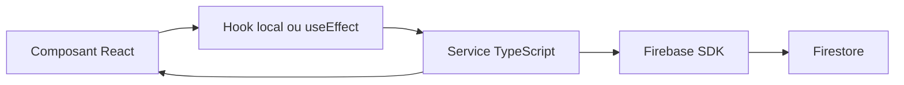

# Architecture technique

## Stack

| Couche | Technologie |
| --- | --- |
| Application | React 18, TypeScript, React Router DOM 6 |
| Build | Vite 5 |
| UI | Tailwind CSS, Lucide React |
| Backend-as-a-Service | Firebase Auth, Firestore, Analytics, Cloud Messaging |
| Hébergement | Firebase Hosting |
| Qualité | ESLint 9, TypeScript strict |

## Organisation du dépôt

```text
.
├── src/
│   ├── App.tsx
│   ├── main.tsx
│   ├── components/
│   ├── contexts/
│   ├── services/
│   ├── config/
│   ├── utils/
│   └── types.ts
├── public/
│   ├── version.json
│   └── firebase-messaging-sw.js
├── scripts/
│   └── generate-version.cjs
├── firebase.json
├── firestore.rules
├── vite.config.ts
└── tailwind.config.js
```

## Point d'entrée

`src/main.tsx` monte l'application dans `#root`, importe `index.css`, puis lance une vérification périodique de `/version.json`. Si une version déployée diffère de celle stockée dans `localStorage`, un événement `app:update-available` est émis pour permettre à l'interface d'afficher une invite de mise à jour.

## Providers globaux

`src/App.tsx` enveloppe l'application avec:

1. `BrowserRouter`.
2. `AuthProvider`.
3. `NotificationProvider`.

`AuthProvider` dépend de Firebase Auth et charge le document utilisateur depuis Firestore. `NotificationProvider` dépend de `useAuth`, initialise FCM si possible, puis écoute les notifications Firestore de l'utilisateur courant.

## Routage

Le routage est centralisé dans `src/App.tsx`.



Les routes privées exigent `user !== null`. Les routes `adminOnly` exigent `user.isAdmin === true`.

## Couche services

Chaque fichier dans `src/services/` encapsule les appels Firestore d'un domaine:

- `objectiveService.ts`: objectifs, progression, hiérarchie, notifications.
- `kpiService.ts`: KPIs/key results, contributeurs, liens objectifs.
- `taskService.ts`: tâches, commentaires, sous-tâches, notifications.
- `projectService.ts`: projets et notifications membres.
- `appraisalService.ts`: cycles, templates, appraisals, responses, feedback 360, analytics.
- `userService.ts` et `adminService.ts`: profils utilisateurs et opérations d'administration.
- `notificationService.ts`: FCM et notifications Firestore.
- `messageService.ts`: channels, messages, réactions, typing.
- `planningService.ts`: événements, ressources, comptes rendus.
- `reportService.ts`, `analyticsService.ts`, `supportService.ts`, `integrationService.ts`, `countryService.ts`, `departmentService.ts`, `settingsService.ts`, `teamService.ts`, `onboardingService.ts`.

Le pattern dominant est:



Certains services utilisent `onSnapshot` pour le temps réel: objectifs, messages, channels, typing status et notifications.

## Firebase

`src/config/firebase.ts` initialise:

- `app = initializeApp(firebaseConfig)`.
- `analytics = getAnalytics(app)`.
- `db = getFirestore(app)`.
- `auth = getAuth(app)`.
- `enableIndexedDbPersistence(db)` pour la persistance offline Firestore.

Les variables Firebase sont injectées via `import.meta.env.VITE_*`.

## État applicatif

L'application utilise principalement:

- React state local (`useState`, `useEffect`).
- React Context pour `AuthContext` et `NotificationContext`.
- Listeners Firestore pour certains flux temps réel.

Il n'y a pas de store global externe comme Redux, Zustand ou React Query.

## Données et timestamps

Les services utilisent un mélange de:

- `serverTimestamp()` Firestore.
- `new Date().toISOString()`.
- `Timestamp` Firestore.

Cette hétérogénéité doit être prise en compte dans les filtres, tris et analytics. Les écrans existants convertissent parfois les timestamps de manière défensive, par exemple dans `analyticsService.ts`.

## Build et versioning

Le script `prebuild` exécute `scripts/generate-version.cjs`, qui écrit `public/version.json` avec un ISO timestamp. Le script `build` lance ensuite Vite et copie ce fichier vers `dist/version.json`.

Firebase Hosting sert:

- `/index.html` et `/version.json` en `no-cache`.
- `/assets/**` avec cache long et immutable.
- toutes les routes vers `/index.html` pour le fallback SPA.
