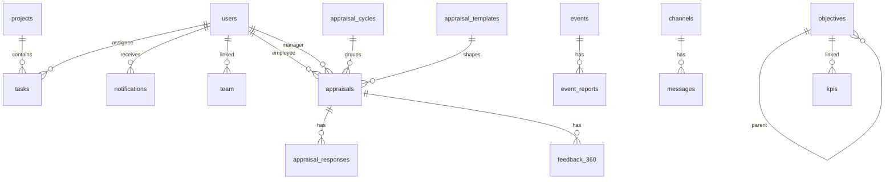

# Modèle de données Firestore

## Vue d'ensemble

La plateforme utilise Firestore directement depuis le frontend. Les collections sont découvertes dans `src/services`.

## Collections principales

| Collection | Service | Usage |
| --- | --- | --- |
| `users` | `userService`, `adminService` | Profils applicatifs, rôles, permissions, pays, FCM. |
| `roles` | `adminService` | Permissions persistées par rôle si utilisées. |
| `objectives` | `objectiveService` | Objectifs hiérarchiques. |
| `kpis` | `kpiService` | KPIs/key results. |
| `projects` | `projectService` | Projets. |
| `tasks` | `taskService` | Tâches et commentaires. |
| `team` | `teamService`, `userService` | Membres d'équipe et liens managers. |
| `departments` | `departmentService` | Départements. |
| `countries` | `countryService` | Pays actifs/inactifs. |
| `notifications` | `notificationService` | Notifications utilisateur. |
| `settings` | `settingsService` | Préférences utilisateur. |
| `appraisal_cycles` | `AppraisalService` | Cycles d'évaluation. |
| `appraisal_templates` | `AppraisalService` | Templates d'évaluation. |
| `appraisals` | `AppraisalService` | Évaluations annuelles. |
| `appraisal_responses` | `AppraisalService` | Réponses soumises. |
| `feedback_360` | `AppraisalService` | Feedback 360. |
| `events` | `planningService` | Événements planning. |
| `resources` | `planningService` | Ressources planning. |
| `event_reports` | `planningService` | Comptes rendus d'événements. |
| `channels` | `messageService` | Canaux de discussion. |
| `messages` | `messageService` | Messages. |
| `typing` | `messageService` | Statuts de saisie temporaires. |
| `reports` | `reportService` | Rapports configurés. |
| `integrations` | `integrationService` | Intégrations externes. |
| `support_tickets` | `supportService` | Tickets support. |
| `support_articles` | `supportService` | Base de connaissance. |
| `onboarding_progress` | `onboardingService` | Progression onboarding par utilisateur. |

## `users`

Champs principaux:

- `id`
- `email`
- `displayName`
- `role`
- `department`
- `managerId`
- `photoURL`
- `isAdmin`
- `countryIds`
- `createdAt`
- `lastLogin`
- `lastSeen`
- `permissions`
- `customClaims`
- `teamMemberId`
- `fcmTokens`
- `notificationSettings`

Relations:

- `managerId` pointe vers `users/{id}`.
- `teamMemberId` pointe vers `team/{id}`.
- `countryIds` pointe vers `countries/{id}`.

## `objectives`

Champs principaux:

- `title`
- `description`
- `level`: `company`, `department`, `individual`
- `status`
- `progress`
- `dueDate`
- `quarter`
- `year`
- `parentId`
- `department`
- `departmentId`
- `contributors`
- `kpiIds`
- `keyResults`
- `progressHistory`
- `createdAt`
- `updatedAt`

Relations:

- `parentId` pointe vers un autre objectif.
- `kpiIds` ou `objectiveIds` côté KPI relient objectifs et indicateurs.
- `contributors` pointe vers des utilisateurs.

## `kpis`

Champs principaux:

- `name`
- `description`
- `value`
- `target`
- `unit`
- `progress`
- `trend`
- `status`
- `category`
- `frequency`
- `startDate`
- `dueDate`
- `lastUpdated`
- `history`
- `objectiveIds`
- `contributors`
- `createdAt`
- `updatedAt`

Relations:

- `objectiveIds` pointe vers `objectives`.
- `contributors` pointe vers `users`.

## `projects`

Champs principaux:

- `name`
- `description`
- `status`
- `progress`
- `startDate`
- `dueDate`
- `budget`
- `department`
- `countryIds`
- `teamMembers`
- `objectives`
- `tasks`
- `risks`
- `documents`
- `createdAt`
- `updatedAt`

Relations:

- `countryIds` pointe vers `countries`.
- `teamMembers` pointe vers `users` ou `team` selon usage UI.
- `objectives` pointe vers `objectives`.
- Les tâches peuvent être intégrées au projet et/ou stockées dans `tasks` avec `projectId`.

## `tasks`

Champs principaux:

- `title`
- `description`
- `status`
- `priority`
- `assignee`
- `projectId`
- `objectiveId`
- `dueDate`
- `subtasks`
- `comments`
- `createdAt`
- `updatedAt`
- `createdBy`

Relations:

- `assignee` et `createdBy` pointent vers `users`.
- `projectId` pointe vers `projects`.
- `objectiveId` pointe vers `objectives`.

## Évaluations annuelles

### `appraisal_cycles`

- `name`
- `year`
- `startDate`
- `endDate`
- `status`
- `description`
- `countryIds`
- `createdBy`
- `createdAt`
- `updatedAt`

### `appraisal_templates`

- `name`
- `description`
- `reviewType`
- `sections`
- `isDefault`
- `createdBy`
- `createdAt`
- `updatedAt`

Chaque section contient `title`, `description`, `weight`, `questions`, `order`.

### `appraisals`

- `cycleId`
- `employeeId`
- `managerId`
- `templateId`
- `status`
- `selfReview`
- `managerReview`
- `hrReview`
- `goals`
- `competencies`
- `overallRating`
- `comments`
- `nextSteps`
- `developmentPlan`
- `createdAt`
- `updatedAt`
- `submittedAt`
- `completedAt`

### `appraisal_responses`

Stocke les réponses soumises avec:

- `appraisalId`
- `type`: `self`, `manager`, `hr`
- `responses`
- `submittedAt`
- `submittedBy`

### `feedback_360`

- `appraisalId`
- `revieweeId`
- `reviewerId`
- `relationship`
- `responses`
- `status`
- `submittedAt`
- `createdAt`

## Planning

### `events`

- `title`
- `type`
- `start`
- `end`
- `description`
- `participants`
- `location`
- `status`
- `priority`
- `project`
- `resources`
- `report`

### `resources`

Le type `Resource` est utilisé par le planning mais n'est pas exporté dans `src/types.ts` au moment de l'analyse. Le composant montre les champs:

- `name`
- `type`
- `availability`
- `capacity`
- `assigned`
- `status`

### `event_reports`

- `eventId`
- `title`
- `content`
- `attendees`
- `decisions`
- `actionItems`
- `attachments`
- `createdBy`
- `createdAt`
- `updatedAt`

## Messagerie

### `channels`

- `name`
- `description`
- `type`
- `members`
- `createdBy`
- `createdAt`
- `lastMessage`
- `unreadCount`
- `updatedAt`
- `lastActivity`
- `messageCount`

### `messages`

- `channelId`
- `content`
- `authorId`
- `authorName`
- `timestamp`
- `edited`
- `editedAt`
- `reactions`
- `attachments`
- `status`
- `readAt`

Attention: `messageService.sendMessage` utilise aussi une forme `message.sender.name`, non alignée avec l'interface `Message`.

### `typing`

Document id: `${channelId}_${userId}`.

- `channelId`
- `userId`
- `timestamp`

## Index Firestore probables

Les requêtes combinent souvent `where` et `orderBy`. Prévoir des index composites pour:

- `kpis`: `createdAt desc`, `objectiveIds array-contains`, `contributors array-contains`.
- `tasks`: `projectId + createdAt desc`, `assignee + createdAt desc`.
- `notifications`: `userId + createdAt desc`, `userId + status`.
- `messages`: `channelId + timestamp asc`.
- `channels`: `members array-contains`.
- `support_tickets`: `userId + createdAt desc`.
- `support_articles`: `category + lastUpdated desc`.
- `appraisal_cycles`: `year desc + createdAt desc`.
- `appraisals`: `cycleId + createdAt desc`, `employeeId + createdAt desc`, `managerId + createdAt desc`.
- `event_reports`: `eventId`.
- `countries`: `isActive + name asc`, `region + isActive + name asc`.

Firestore proposera automatiquement les liens de création d'index en cas d'erreur.
