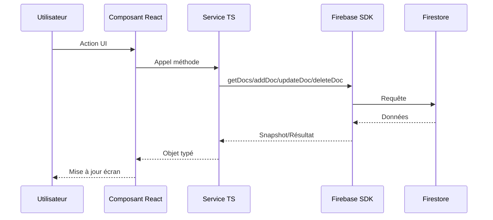
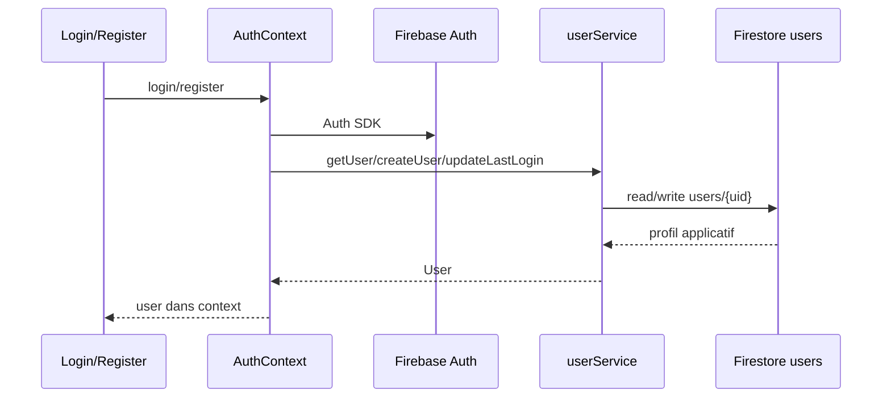

# Services et flux de données

## Pattern général

Les composants React appellent des services TypeScript dans `src/services`. Ces services encapsulent les opérations Firebase SDK. Il n'y a pas de backend applicatif dans ce dépôt.

## Services par domaine

| Service | Méthodes principales |
| --- | --- |
| `settingsService` | `getUserSettings`, `updateUserSettings` |
| `kpiService` | `getKPIs`, `getKPIsByObjective`, `getUnlinkedKPIs`, `addKPI`, `updateKPI`, `deleteKPI`, `addContributor`, `removeContributor`, `getKPIsByContributor` |
| `adminService` | `getUsers`, `updateUser`, `deleteUser`, `updateRole` |
| `userService` | `createUser`, `getUser`, `getAllUsers`, `updateUser`, `updateLastLogin`, `updateLastSeen`, `deleteUser`, `linkTeamMember`, `getTeamMember` |
| `AppraisalService` | cycles, templates, appraisals, responses, feedback360, analytics, bulk creation, rating recalculation, objective import |
| `departmentService` | `getDepartments`, `getDepartment`, `addDepartment`, `updateDepartment`, `deleteDepartment`, `getDepartmentsByManager`, `updateDepartmentKPIs`, `updateDepartmentTeams` |
| `reportService` | `getReports`, `createReport`, `updateReport`, `deleteReport`, `generateReport` |
| `analyticsService` | `getAnalyticsByPeriod` |
| `teamService` | `getTeamMembers`, `addTeamMember`, `updateTeamMember`, `deleteTeamMember`, `getTeamMemberByUserId` |
| `taskService` | `getTasks`, `getTasksByProject`, `getTasksByAssignee`, `addTask`, `updateTask`, `deleteTask`, `addComment`, `updateSubtask` |
| `projectService` | `getProjects`, `addProject`, `updateProject`, `deleteProject` |
| `supportService` | tickets, commentaires, articles, rating, recherche |
| `notificationService` | FCM, CRUD notifications, abonnement temps réel, compteur non lu |
| `countryService` | CRUD pays, actifs, par région, recherche, toggle, stats |
| `planningService` | événements, comptes rendus, ressources |
| `messageService` | channels, messages, réactions, typing status, membres |
| `objectiveService` | CRUD objectifs, abonnement temps réel, archive, progression, calcul parent, suppression |
| `onboardingService` | progression onboarding, étape complétée, dismiss, reset |
| `integrationService` | CRUD intégrations, statut, filtre par type |

## Flux Auth

## Flux objectif

Création:

1. Le composant `Objectives` appelle `addObjective`.
2. `objectiveService.addObjective` crée un document `objectives`.
3. Si l'objectif a un parent, le parent est marqué `updatedAt`.
4. Le service retourne l'objectif avec son id Firestore.

Mise à jour:

1. Lecture de l'objectif courant.
2. Batch update de l'objectif.
3. Update du parent si nécessaire.
4. Notifications best-effort vers owner/contributeurs.
5. Recalcul de progression parent.

Progression:

1. Update direct de `progress`.
2. Statut calculé: `>=90 on-track`, `>=60 at-risk`, sinon `behind`.
3. Ajout dans `progressHistory`.
4. Recalcul récursif du parent.

Calcul:

- Si enfants: moyenne des progressions enfants.
- Sinon si key results intégrés: moyenne des progressions de key results.
- Sinon: progression directe existante.

## Flux KPI

Création et mise à jour sont des opérations Firestore simples. La suppression est plus riche:

1. Vérifier utilisateur Firebase Auth.
2. Lire le KPI.
3. Retirer l'id KPI de chaque objectif lié via `arrayRemove`.
4. Supprimer le KPI.
5. Recalculer la progression des objectifs affectés.

## Flux tâche

Création:

1. Vérifier utilisateur connecté.
2. Ajouter `createdBy`, `createdAt`, `updatedAt`.
3. Créer `tasks/{id}`.
4. Notifier l'assigné si différent du créateur.

Commentaire:

1. Créer un commentaire local avec id timestamp.
2. Ajouter via `arrayUnion`.
3. Notifier l'assigné si différent de l'auteur.

Sous-tâche:

`updateSubtask` utilise actuellement `arrayUnion({ id, completed })`. Cette approche ajoute une entrée et ne remplace pas forcément l'ancienne sous-tâche; à revoir si l'objectif est une mise à jour stricte.

## Flux appraisals

### Création de cycle et template

Cycles et templates sont des CRUD simples sur leurs collections respectives.

### Génération en masse

`createAppraisalsForCycle(cycleId, employeeIds, templateId)`:

1. Charge les utilisateurs.
2. Détermine le manager depuis `user.managerId`, sinon depuis la collection `team`, sinon fallback sur l'employé.
3. Crée un appraisal en statut `draft` pour chaque employé.
4. Notifie employés et managers.

### Soumission de réponse

`submitResponse(appraisalId, response, type)`:

1. Écrit une entrée dans `appraisal_responses`.
2. Charge l'appraisal courant.
3. Charge le template.
4. Met à jour `selfReview`, `managerReview` ou `hrReview`.
5. Avance le statut selon `reviewType`.
6. Calcule `overallRating` sur les réponses numériques.
7. Notifie l'acteur suivant ou les parties concernées.

## Flux notifications

Il existe deux formes de notifications:

1. Notifications Firestore, persistées dans `notifications`.
2. Notifications push navigateur via FCM.

Le contexte `NotificationProvider` écoute `notifications` par `userId` et limite les résultats à 50.

## Flux messagerie

Channels:

- `subscribeToChannels` écoute les channels où `members` contient l'utilisateur courant.
- `createChannel` crée un channel.
- `addChannelMember` et `removeChannelMember` manipulent `members`.

Messages:

- `subscribeToMessages(channelId)` écoute les messages par `channelId`, triés par `timestamp`.
- `sendMessage` écrit le message et met à jour `lastMessage`, `lastActivity` et `messageCount` du channel dans un batch.
- `addReaction` lit le message, modifie le tableau `reactions`, puis update.

Typing:

- Document id `${channelId}_${userId}`.
- Le listener ignore les statuts de plus de 5 secondes.

## Flux analytics

`analyticsService.getAnalyticsByPeriod(period)`:

1. Calcule une plage de dates.
2. Charge objectifs, KPIs et départements.
3. Filtre objectifs par `createdAt` et KPIs par `lastUpdated`.
4. Calcule les métriques.
5. Charge les dernières updates depuis `objectives` et `kpis`.

À noter: les dates sont hétérogènes entre ISO string et Firestore Timestamp selon les services.

## Gestion d'erreurs

Le pattern dominant:

- `try/catch`
- `console.error`
- relance d'une erreur générique ou de l'erreur originale

Les notifications sont généralement best-effort: une erreur de notification ne bloque pas l'opération métier.

## Temps réel

Listeners disponibles:

| Domaine | Méthode |
| --- | --- |
| Objectifs | `objectiveService.subscribeToObjectives` |
| Notifications | `notificationService.subscribeToNotifications` |
| Channels | `messageService.subscribeToChannels` |
| Messages | `messageService.subscribeToMessages` |
| Typing | `messageService.subscribeToTypingStatus` |

Les autres modules fonctionnent principalement en chargement ponctuel et refresh manuel.
